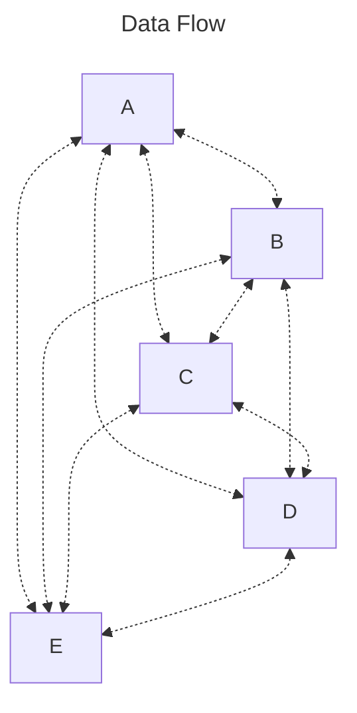
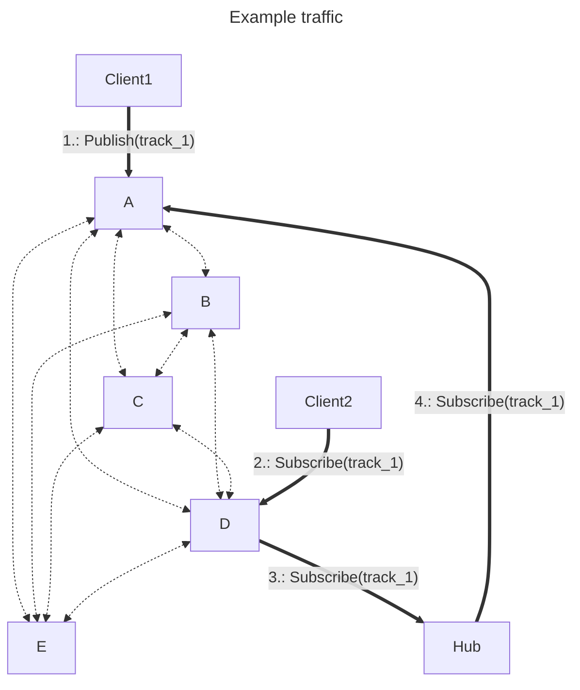

# Full Mesh

```mermaid
---
title: Data Flow
---
flowchart TD
	A <-.-> B
	A <-.-> C
	A <-.-> D
	A <-.-> E
	B <-.-> C
	B <-.-> D
	B <-.-> E
	C <-.-> D
	C <-.-> E
	D <-.-> E
```

```mermaid
---
title: Example traffic
---
flowchart TD
	A <-.-> B
	A <-.-> C
	A <-.-> D
	A <-.-> E
	B <-.-> C
	B <-.-> D
	B <-.-> E
	C <-.-> D
	C <-.-> E
	D <-.-> E

	Client1 == 1.: Publish(track_1)   ==> A
	Client2 == 2.: Subscribe(track_1) ==> D
	D       == 3.: Subscribe(track_1) ==> Hub
	Hub     == 4.: Subscribe(track_1) ==> A
```
