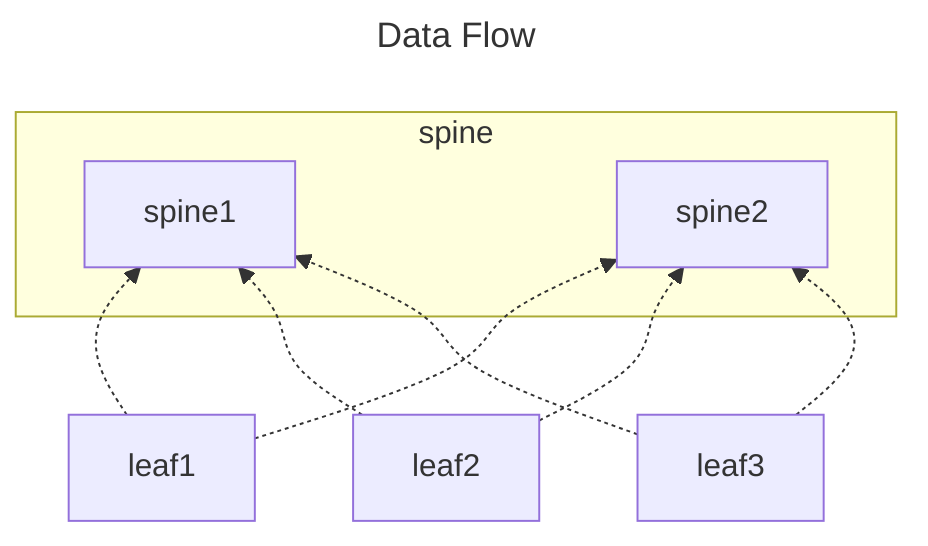
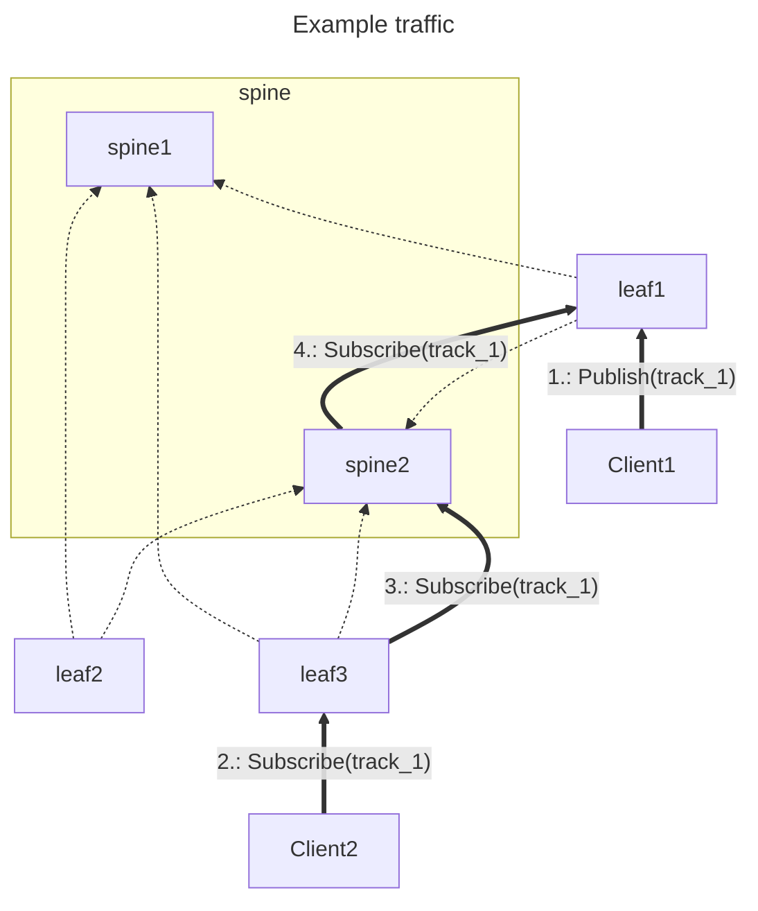

# Spine and Leaf

```mermaid
---
title: Data Flow
---
flowchart BT
	subgraph spine
		spine1
		spine2
	end
	leaf1 -.-> spine1
	leaf1 -.-> spine2
	leaf2 -.-> spine1
	leaf2 -.-> spine2
	leaf3 -.-> spine1
	leaf3 -.-> spine2
```

```mermaid
---
title: Example traffic
---
flowchart BT
	subgraph spine
		spine1
		spine2
	end
	leaf1 -.-> spine1
	leaf1 -.-> spine2
	leaf2 -.-> spine1
	leaf2 -.-> spine2
	leaf3 -.-> spine1
	leaf3 -.-> spine2

	Client1 == 1.: Publish(track_1)   ==> leaf1
	Client2 == 2.: Subscribe(track_1) ==> leaf3
	leaf3   == 3.: Subscribe(track_1) ==> spine2
	spine2  == 4.: Subscribe(track_1) ==> leaf1
```
