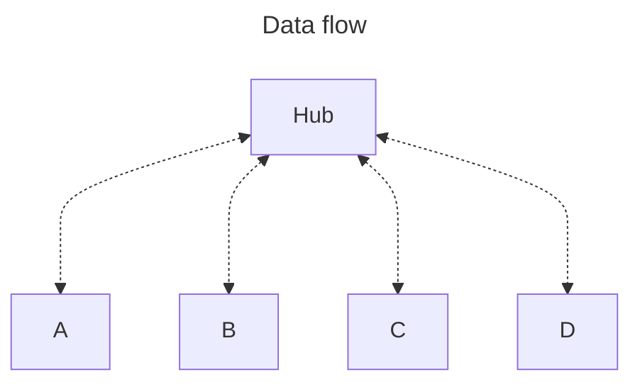
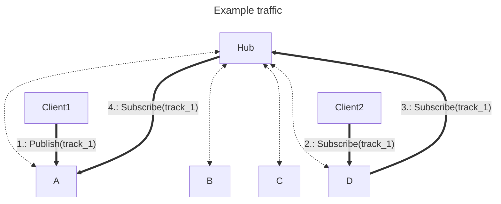

# Star

```mermaid
---
title: Data flow
---
flowchart TD
	Hub <-..-> A
	Hub <-..-> B
	Hub <-..-> C
	Hub <-..-> D
```

```mermaid
---
title: Example traffic
---
flowchart TD
	Hub <-..-> A
	Hub <-..-> B
	Hub <-..-> C
	Hub <-..-> D

	Client1 == 1.: Publish(track_1)   ==> A
	Client2 == 2.: Subscribe(track_1) ==> D
	D       == 3.: Subscribe(track_1) ==> Hub
	Hub     == 4.: Subscribe(track_1) ==> A
```
